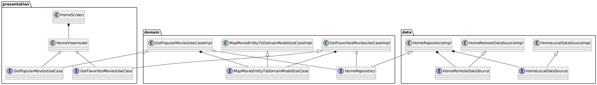
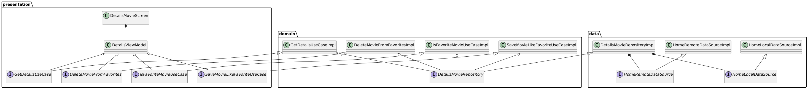
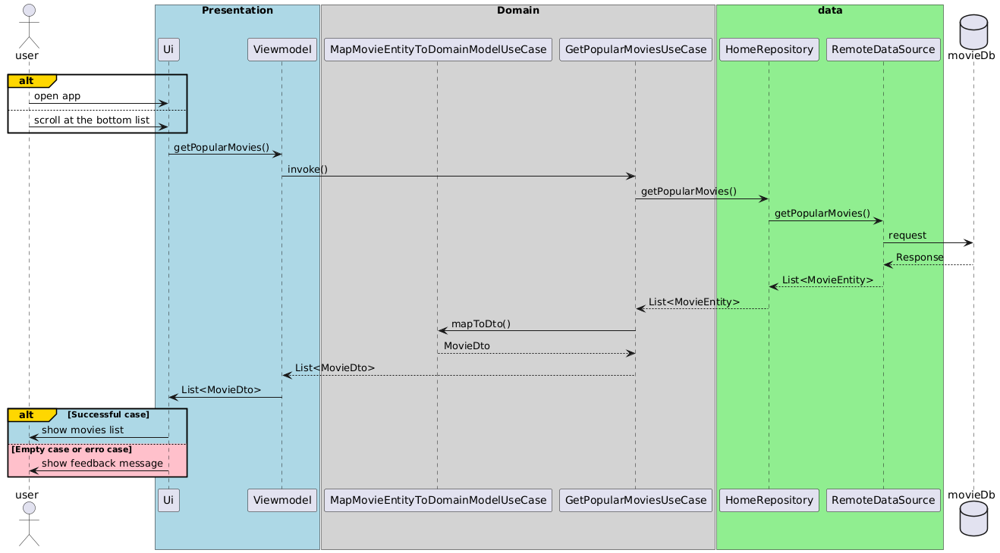
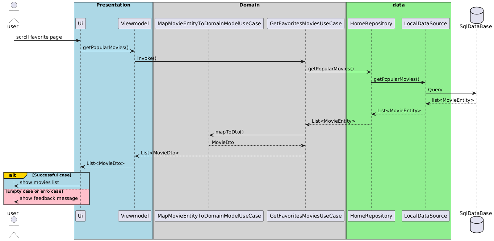
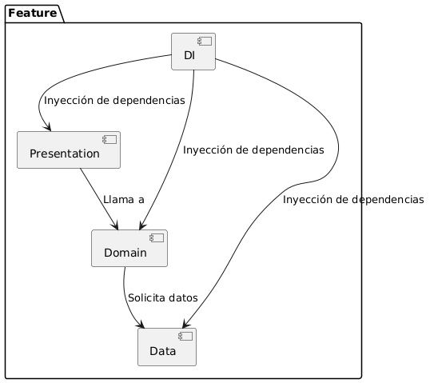

# Popular Movies App

## Project Overview

This mobile application is designed to showcase the most popular movies using TheMovieDB API. The app allows users to:
- Browse popular movies
- View detailed movie information
- Save favorite movies locally

## Features

### Home
- List most popular movies
- List Favorites movies
    - Access saved favorites without internet connection

### Details movies
- Save favorite movies locally
- Show movies information

## Technologies Used

- **Mobile Platform**: [Specify your platform - Android]
- **Programming Language**: [Specify language - Kotlin]
- **API**: TheMovieDB API

## Architectural Considerations

- Clean Architecture implementation
- Modular design
- Dependency Injection
- Secure token management

## Testing

- Unit tests for core logic
- Presentation layer logic tests

## Security Notes
- API key management
- Secure token handling

## Architecture Diagrams

### System Architecture Diagram
**Home architecture**

**Details architecture**

### Data Flow Diagram
**Get popular movies**

**Get favorites movies**

### Component Diagram
